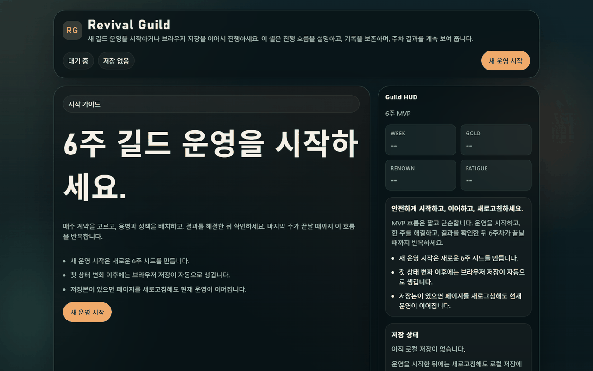
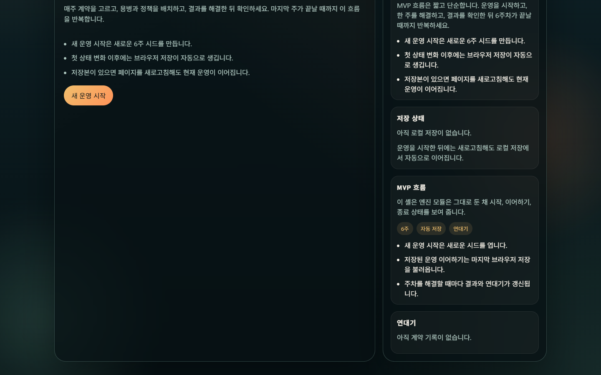

# Revival Guild

> **TL;DR (EN):** A browser-game prototype about running a mercenary guild and keeping character records over time.
> What worked: hiring, dispatch, weekly results, resources, and chronicle-style records.
> What still needs human judgment: visual storytelling, attachment, event variety, and turning records into felt narrative. (as of 2026-04, using Codex)

### 2026-04 시점 화면

나중에 같은 아이디어를 다시 만들면 이 섹션 아래에 재시도 화면을 추가해, 당시 AI 도구가 어디까지 달라졌는지 비교합니다.

## 무엇을 확인하려고 만들었는가

`Revival Guild`는 용병 길드를 운영하는 브라우저 게임 컨셉 실험입니다.

출발점은 낮은 등급 캐릭터가 쉽게 버려지는 게임 구조에 대한 반대편 감각이었습니다. 성능 좋은 캐릭터만 남기고 약한 캐릭터를 교체하는 대신, 낮은 등급의 용병도 길드의 시간 속에서 기록과 의미를 가질 수 있는지 확인하고 싶었습니다.

플레이어는 직접 싸우는 영웅보다 길드장에 가깝습니다. 용병을 고용하고, 의뢰에 보내고, 결과를 받고, 다치거나 성장하거나 은퇴하는 기록이 쌓이는 구조를 상상했습니다.

실행: `index.html`을 브라우저로 열면 실행됩니다.

## 실제로 작동한 것

- 용병 고용
- 파티/배치 흐름
- 의뢰 파견
- 주차 진행
- 결과 텍스트
- 골드/명성/자원 변화
- chronicle/save 계열 기록 구조
- 브라우저에서 돌아가는 기본 루프

이 실험에서 확인한 것은 AI coding agent가 작은 경영 게임의 규칙과 기록 구조를 빠르게 만들 수 있다는 점입니다. 캐릭터, 의뢰, 결과, 평판, 시간 진행 같은 뼈대는 짧은 시간 안에 구현할 수 있었습니다.

## 부족했던 것

(2026-04, Codex 기준) 기록은 있었지만, 기록만으로 서사가 되지는 않았습니다.

용병에게 애착을 느끼려면 얼굴, 장비, 상태 변화, 파견 지역의 차이, 사건의 무게, 시간이 흘렀다는 시각적 단서가 필요했습니다. 현재 버전은 데이터 구조의 방향은 있었지만, 화면 경험은 정적인 텍스트 웹게임에 가까웠습니다.

즉, "어디를 다녀왔고 어떤 일이 있었다"는 기록은 쌓였지만, 플레이어가 그 용병을 기억하고 아끼게 만드는 경험까지는 도달하지 못했습니다.

## 재시도 시 비교할 포인트

- 용병 얼굴/장비/부상/은퇴 상태 같은 최소 시각 단서
- 파견 지역별 사건과 결과의 차이
- 단순 로그가 아니라 캐릭터별 기억과 관계가 쌓이는 구조
- 플레이어가 효율보다 애착을 선택할 수 있는 시스템
- 현재 2026-04 버전과 이후 AI 모델/엔진 기반 재시도 버전 비교

## 관련 기록

이 프로젝트는 [AI Game Prototyping Experiments](https://github.com/rep87/ai-game-prototyping-experiments)의 일부입니다.

현재 레포는 완성작이 아니라 컨셉 중심 실험 기록입니다.
